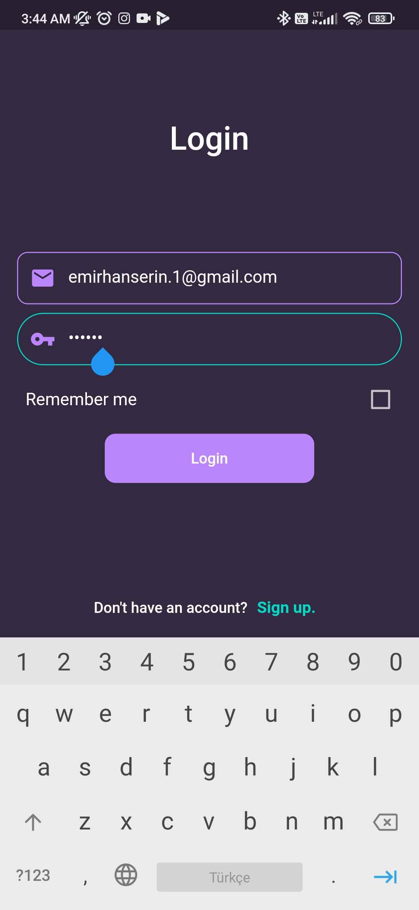
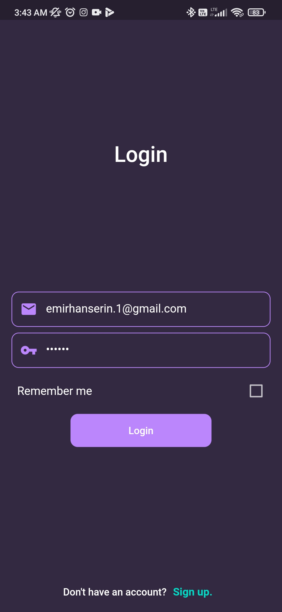
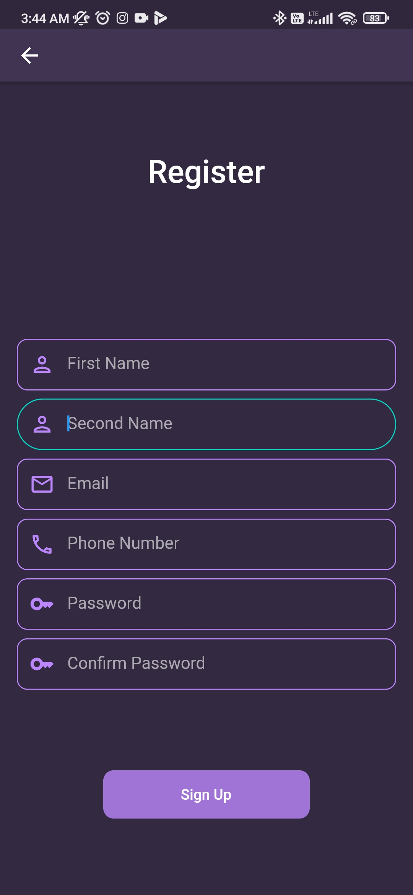
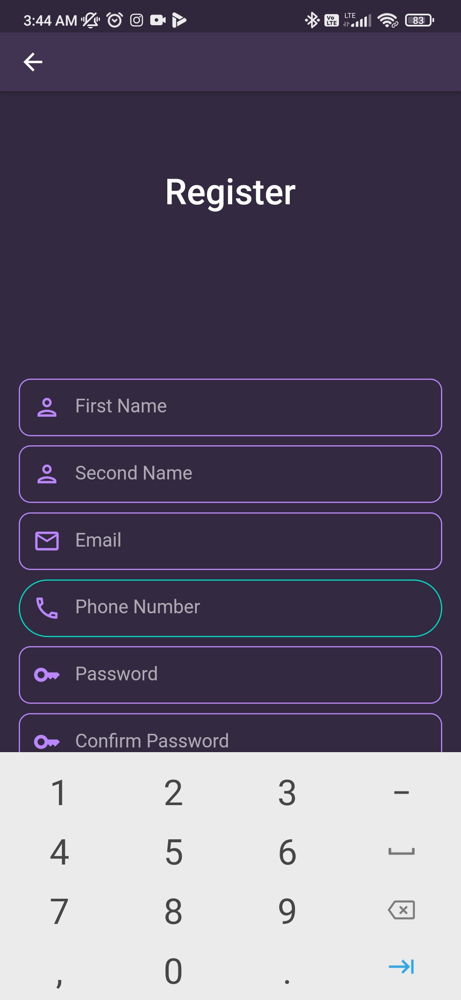
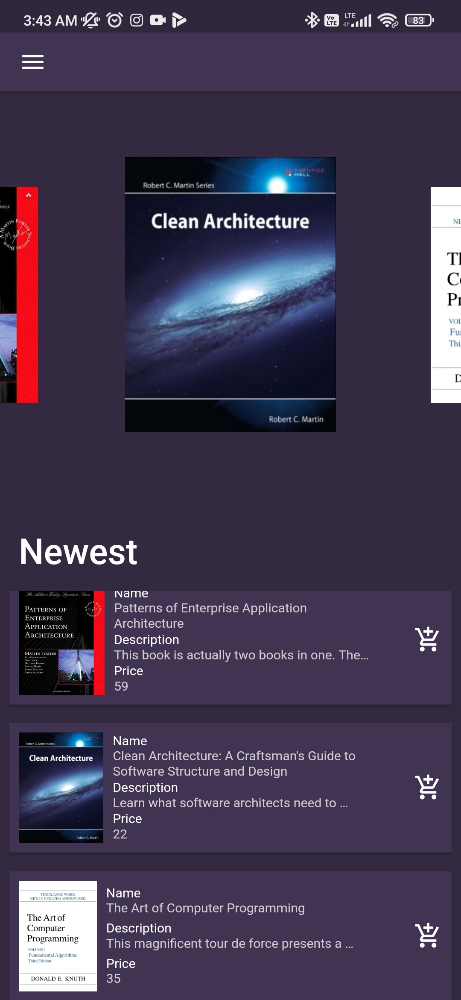
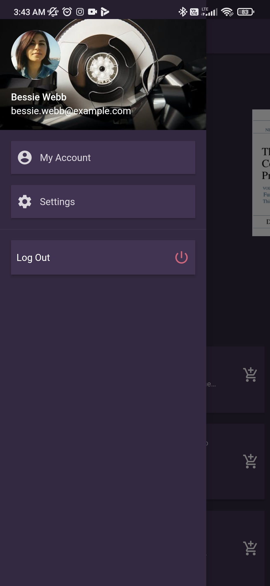
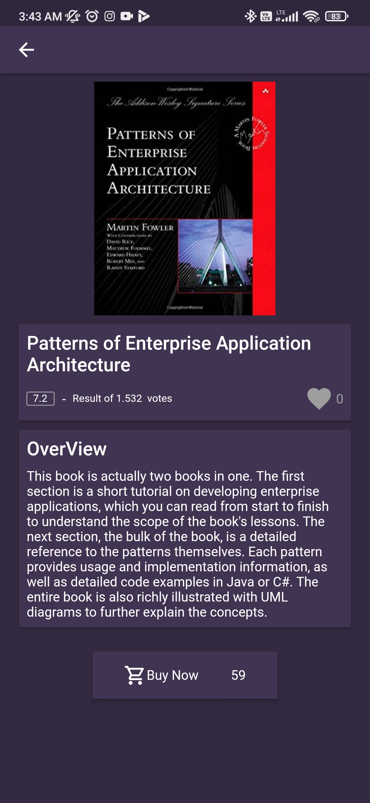
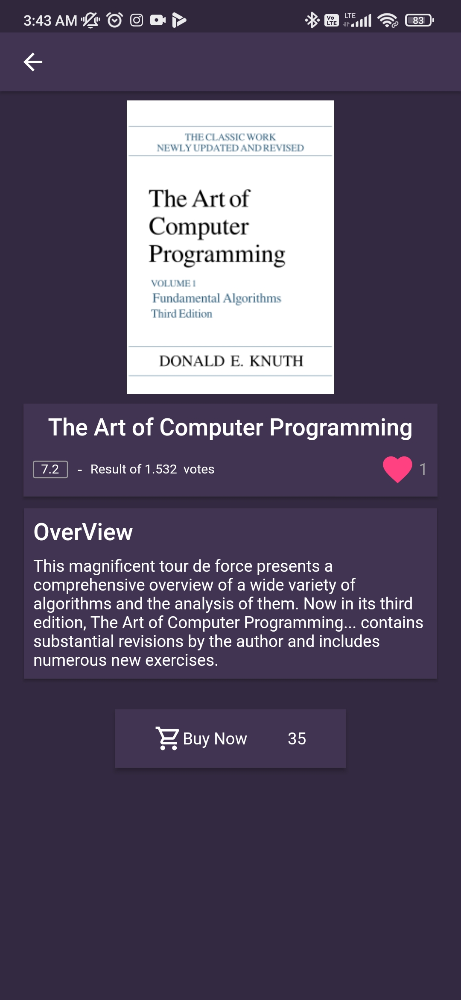
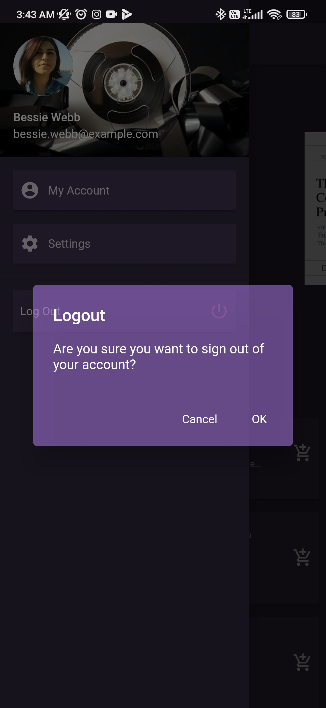

# urun_katalog

Flutter ile yapılmış bir ürün katalog projesidir. State management olarak provider ve setState kullanılmıştır.

## Getting Started

Bu proje bir örnek apiden çekilen verilerle inşa edilmiş bir projedir.

Projede kullandığım bazı ayrıntılar.

# *
- Atomic Widget: Widgetleri components ve constantslarına parçalayıp, geliştirmeye açık ve okunması kolay hale getirdim.
# *

- Theme: Theme dosyama atadığım Material Renkler ile birlikte, Theme.of(context) ile dinamik bir geçiş sağladım.

- Material Design: https://material.io/design/color/dark-theme.html baz alarak, Projedeki bütün colorlar dinamik hale getirdim. Sonraki süreçlerde light temaya geçilebileceğini düşünerek Colorları DarkTheme classımdan çektim. Bu sayede Color switch yapmak çok basit bir iş haline geldi.

- Static properties yok: Projedi bütün sabit veriler ilgili classlar içerisine toplanıp, static hale getirildi. Bu sayede ilgili bölgelere çok daha stabil bir şekilde veri ataması yapılabiliyor.

- cached_network_image ile network den gelen resimleri cache leyip daha sonrasında çok daha hızlı ve ufak bir animasyonla ekrana veriyor.

- RepaintBoundary: İlgili widgetın yeniden çizilmesi gereken bir durumda. Eğer widget bütün ekranı etkiliyorsa, çıkabilicek performans sorunlarını önlemek amacıyla kullanılır. Sadece ilgili widget yeniden çizilir.

- Animasyon PageRoute: Sayfalar arası geçişleri animasyonlar ile süsleyerek, göze çok daha güzel gelebilicek şekilde kodladım.

- Ekran kaydının sonunda kendi yaptığım diğer uygulamalardan kısa bir kesit ekledim.

  
  
  
  
  
  
  
  
  
  

